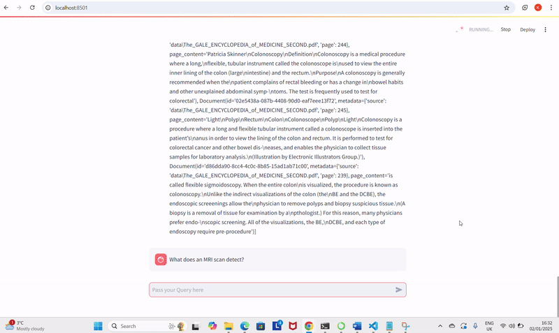

# MedBot ( Context-Aware-AI-Assistant )

It is an intelligent chatbot application designed to assist users in retrieving precise and contextually relevant answers to medical-related queries. Powered by advanced LLMs, vector-based document retrieval, and a customizable prompt system, the application integrates:

Vector Store (FAISS): For efficient storage and retrieval of medical documents using semantic similarity.

HuggingFace LLM Integration: To process and generate accurate and context-driven responses.

Streamlit Interface: For an interactive and user-friendly chat experience.

This tool ensures responses are drawn strictly from the provided knowledge base, offering reliable and trustworthy information in the medical domain.

